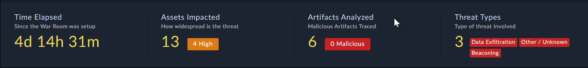
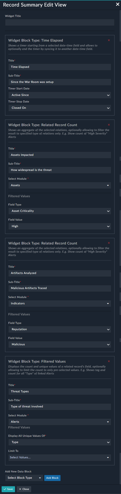

## Record Summary

Displays a particular record’s highlights and summary for quick insight. This widget is composed of the following widget blocks:  

*	Time Elapsed  
*	Related Record Count  
*	Field Value Display  

Users can add up to 4 widget blocks as a part of the **Record Summary** widget.

 

**Record Summary Edit View**:

 

**Certified**: Yes  

**Publisher**: Fortinet  

**Compatibility**: 7.0.2 or higher

**Applicable**: View Panel

**Widget Details**:  
The following information need to be filled:

<h3 style="border-bottom: 1.8px solid gray;"> Time Elapsed</h3> 

Displays the time that has elapsed depending on the date-time field that has been selected for the record.

| Fields      | Description          |
| -------- | -------------- |
| Title | Enter the name of the ‘Time Elapsed’ block. |
| Sub-Title | Enter the summary of the ‘Time Elapsed’ block. |
| Timer Start Date | Select the date-time field that indicates when the timer should start. |
| Timer Stop Date | Select the date-time field that indicates when the timer should stop. |

<h3 style="border-bottom: 1.8px solid gray;"> Related Record Count</h3> 

Displays the total count of correlated records along with the count of records depending on a specified condition.

| Fields     | Description          |
| -------- | -------------- |
| Title | Enter the name of the ‘Related Record Count’ block. |
| Sub-Title | Enter the summary of the ‘Related Record Count’ block. |
| Select Module | Select the module for which the record count needs to be displayed. |
| Filtered Values: Field Type | Select the field type on which the records should be filtered. |
| Filtered Values: Field Value | Select the value of the field on which the records should be filtered. |

<h3 style="border-bottom: 1.8px solid gray;"> Field Value Display</h3> 

Displays the count and unique values of a related record's field, optionally allowing to limit the count to only pre-selected values.

| Fields     | Description          |
| -------- | -------------- |
| Title | Enter the name of the ‘Field Value Display’ block. |
|Sub-Title | Enter the summary of the ‘Field Value Display’ block. |
| Select Module | Select the module on which the filter needs to be applied in order to display the count of filtered values. In the field-value nomenclature, the **module** is equivalent to the **field**. |
| Filtered Values: Display All Unique Values Of | Select the field on which the records should be filtered. In the field-value nomenclature, **Display All Unique Values Of** is equivalent to the **value**. |
| Filtered Values: Limit To | Select the value of the field on which the records should be filtered. |
